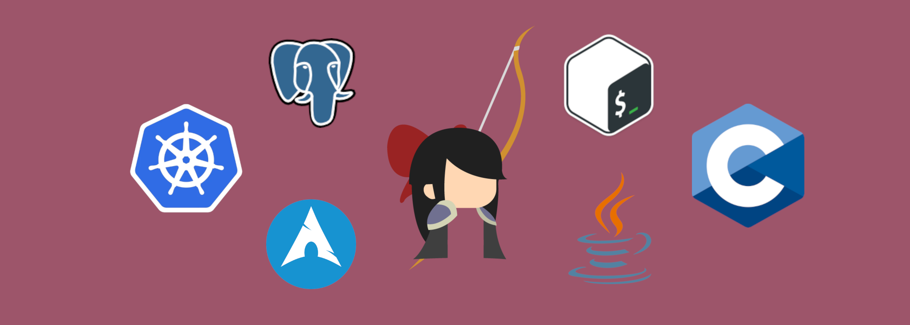

## Things i prefer
Everything _architecturally complex systems_-related: upgrading, optimizing, creating new ones.  
Bonus points for situations when I can put to use my **knowledge of underlying systems and internals**, and futher improve it!
## 🔧 Tech i *believe i know* - check the header
## 🌊 Tech i tried at *shallow* level

## *Still-supported* project with roadmap in progress

## Project that saw most *practical usage*

## Experiences i had
* **one-man** projects, usually with analysis stages
* **devops** in **team of 5** for student project
* **deducing** open source project behaviour **from source code**
* light profiling
* now trying a **manager** role for **team of 10**
* and lots of tinkering with packages and **configs** on various **Linux distribs**
